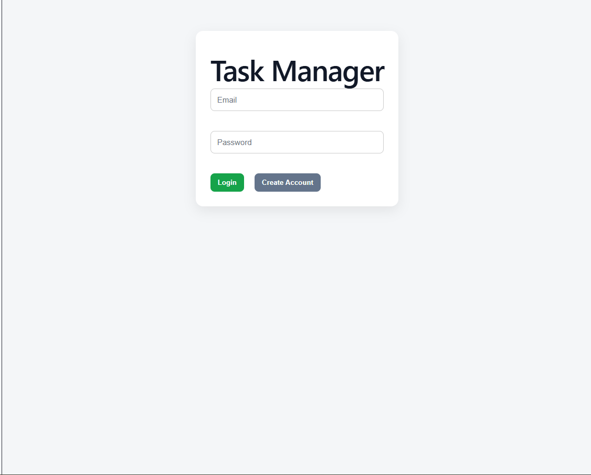
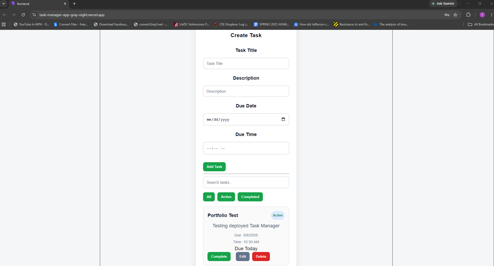
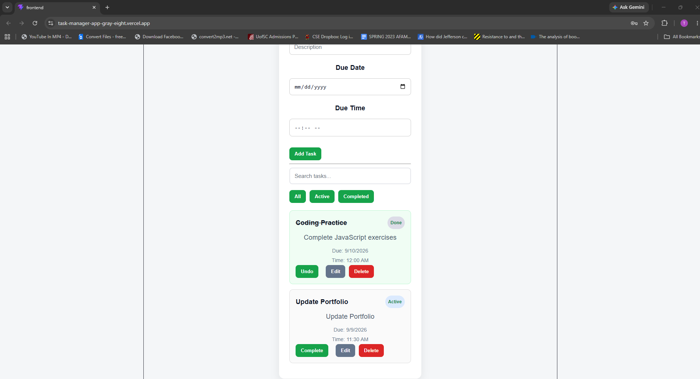

# Task Manager

A full-stack Task Manager web application that allows users to create an account, log in, and manage their personal tasks.

Users can create, edit, complete, search, filter, and delete tasks while assigning due dates and times. The application also provides due-date status indicators and a responsive interface for both desktop and mobile devices.

## Live Demo

**Live Application:**  
https://task-manager-app-gray-eight.vercel.app

**GitHub Repository:**  
https://github.com/TLW500/task-manager-app

> Note: The backend is hosted on Render's free tier and may take a short time to wake up after a period of inactivity.

## Screenshots

### Login



### Task Dashboard



### Task Status and Management



### Mobile Responsive Design


## Features

- User registration and login
- JWT-based authentication
- Secure password hashing
- Create tasks
- Edit existing tasks
- Delete tasks
- Mark tasks as completed
- Undo completed tasks
- Assign due dates and due times
- Due Today, Due Soon, and Overdue indicators
- Search tasks by title or description
- Filter tasks by All, Active, or Completed
- Completed-task styling
- Form validation
- Success and error messages
- Responsive desktop and mobile design
- User-specific task data
- Persistent MongoDB database storage

## Technologies Used

### Frontend

- React
- JavaScript
- Vite
- Axios
- HTML
- CSS

### Backend

- Node.js
- Express
- MongoDB
- Mongoose
- JSON Web Tokens (JWT)
- bcrypt
- CORS
- dotenv

### Deployment

- Vercel — frontend hosting
- Render — backend API hosting
- MongoDB Atlas — cloud database
- GitHub — source control

## Application Architecture

```text
User
  |
  v
React / Vite Frontend
Vercel
  |
  | HTTPS API Requests
  v
Node.js / Express API
Render
  |
  v
MongoDB Atlas
```

The React frontend communicates with the Express backend through REST API requests. The backend handles authentication, task management, validation, and communication with MongoDB Atlas.

## Project Structure

```text
task-manager-app/
│
├── backend/
│   ├── config/
│   ├── controller/
│   ├── middleware/
│   ├── models/
│   ├── routes/
│   ├── server.js
│   └── package.json
│
├── frontend/
│   ├── src/
│   │   ├── components/
│   │   ├── App.jsx
│   │   └── App.css
│   ├── package.json
│   └── vite.config.js
│
├── screenshots/
│   ├── login.png
│   ├── dashboard.png
│   ├── task-features.png
│   └── mobile.png
│
├── .gitignore
└── README.md
```

## API Endpoints

### Authentication

```text
POST /api/auth/register
POST /api/auth/login
```

### Tasks

```text
GET    /api/tasks
POST   /api/tasks
PUT    /api/tasks/:id
DELETE /api/tasks/:id
PUT    /api/tasks/:id/toggle
```

Task routes are protected and require a valid JWT.

## Running the Project Locally

### 1. Clone the repository

```bash
git clone https://github.com/TLW500/task-manager-app.git
cd task-manager-app
```

### 2. Install backend dependencies

```bash
cd backend
npm install
```

Create a `.env` file inside the `backend` directory:

```env
PORT=5000
MONGO_URI=your_mongodb_connection_string
JWT_SECRET=your_jwt_secret
CLIENT_URL=http://localhost:5173
```

Never commit your real `.env` file or secrets to GitHub.

Start the backend:

```bash
npm run dev
```

The API will run locally at:

```text
http://localhost:5000
```

### 3. Install frontend dependencies

Open another terminal:

```bash
cd frontend
npm install
```

Create a `.env` file inside the `frontend` directory:

```env
VITE_API_URL=http://localhost:5000
```

Start the frontend:

```bash
npm run dev
```

Open:

```text
http://localhost:5173
```

## What I Learned

Building this project gave me experience developing and deploying a complete full-stack application.

Some of the areas I worked with include:

- Building REST API endpoints with Node.js and Express
- Connecting an application to MongoDB using Mongoose
- Implementing JWT authentication
- Hashing passwords securely with bcrypt
- Protecting routes so users can access only their own tasks
- Connecting a React frontend to a backend API using Axios
- Managing React state and reusable components
- Creating task filtering and search functionality
- Working with dates and times in JavaScript
- Handling timezone-related date formatting
- Building responsive layouts for desktop and mobile devices
- Managing environment variables securely
- Debugging frontend and backend communication
- Deploying a frontend and backend separately
- Configuring CORS for production
- Using Git and GitHub throughout development

## Future Improvements

Possible future additions include:

- Forgot password / password reset
- Email verification
- Change password
- Task priority levels
- Task categories
- Sorting options
- Browser or email notifications
- Dark mode
- Additional user profile settings

## Author

**Tyrrell Wilkins**

Computer Science graduate interested in software development, full-stack development, and game development.

GitHub:  
https://github.com/TLW500